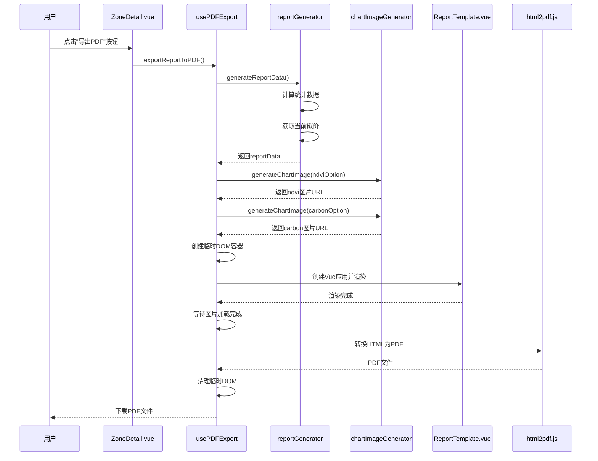

# PDF报告生成功能开发文档

## 目录

- [功能概述](#功能概述)
- [技术架构](#技术架构)
- [核心组件](#核心组件)
- [工作流程](#工作流程)
- [使用方法](#使用方法)
- [模板修改指南](#模板修改指南)
- [常见问题](#常见问题)

---

## 功能概述

PDF报告生成功能用于将监测区的碳汇数据、NDVI趋势、碳吸收量等信息导出为格式化的PDF报告。报告包含执行摘要、项目概况、核心计量结果、植被状况分析、数据质量说明和结论建议等完整内容。

### 主要特性

- **自动化报告生成**：基于监测区数据和图表配置自动生成完整报告
- **图表嵌入**：自动将ECharts图表转换为图片并嵌入PDF
- **分页控制**：智能处理PDF分页，避免内容被截断
- **中文支持**：完整支持中文字体渲染
- **高分辨率输出**：支持高分辨率PDF输出，确保图表清晰

---

## 技术架构

### 技术栈

| 技术 | 版本 | 用途 |
|------|------|------|
| html2pdf.js | 0.14.0 | HTML转PDF核心库 |
| ECharts | 5.4.0 | 图表生成和图片导出 |
| Vue 3 | 3.3.0 | 前端框架，用于模板渲染 |
| jsPDF | (html2pdf.js内置) | PDF文档生成 |

### 依赖关系

```
usePDFExport (Composable)
    ├── ReportTemplate.vue (模板组件)
    ├── reportGenerator.js (数据生成)
    └── chartImageGenerator.js (图表图片生成)
```

---

## 核心组件

### 1. usePDFExport.js

**位置**：`frontend/src/composables/usePDFExport.js`

**功能**：PDF导出的核心逻辑，负责协调整个导出流程。

**主要方法**：

- `exportReportToPDF(zone, chartData, ndviOption, carbonOption, filename)`
  - 导出完整的监测报告为PDF
  - 参数：
    - `zone`: 监测区数据对象
    - `chartData`: 图表数据（包含时间戳、NDVI值、碳吸收量）
    - `ndviOption`: NDVI图表ECharts配置对象
    - `carbonOption`: 碳吸收量图表ECharts配置对象
    - `filename`: 可选，PDF文件名
  - 返回：Promise，成功时下载PDF文件

- `exportToPDF(element, filename)`
  - 通用PDF导出方法，直接导出DOM元素
  - 用于兼容旧版本或简单导出场景

**关键实现细节**：

1. **临时容器创建**：创建屏幕外的临时DOM容器用于渲染模板
2. **Vue组件渲染**：使用`createApp`动态创建Vue应用实例渲染ReportTemplate
3. **图片加载等待**：确保所有图表图片加载完成后再导出
4. **样式处理**：在html2canvas克隆文档时确保字体和样式正确
5. **清理工作**：导出完成后卸载Vue应用并移除临时DOM

### 2. ReportTemplate.vue

**位置**：`frontend/src/components/ReportTemplate.vue`

**功能**：PDF报告的Vue模板组件，定义报告的结构和样式。

**Props**：

- `reportData` (Object, required): 报告数据对象，包含所有需要显示的数据字段

**报告结构**：

1. **报告头部**：标题、报告编号、监测期、生成时间
2. **目录**：自动生成的报告目录
3. **一、监测概述**
   - 1.1 执行摘要
   - 1.2 项目与监测区概况
   - 1.3 监测方法与技术
4. **二、核心计量结果**
   - 2.1 碳汇量评估
   - 2.2 植被状况动态分析（包含NDVI和碳吸收量图表）
   - 2.3 数据质量与说明
5. **三、结论与建议**
6. **报告页脚**：系统信息和免责声明

**样式特点**：

- A4纸张尺寸（210mm宽度）
- 完整的中文字体支持
- 分页控制样式（避免内容被截断）
- 表格和图表的分页保护

### 3. reportGenerator.js

**位置**：`frontend/src/utils/reportGenerator.js`

**功能**：生成报告所需的数据对象。

**主要函数**：

- `generateReportData(zone, chartData)`
  - 根据监测区数据和图表数据生成完整的报告数据对象
  - 包含统计计算、日期格式化、经济价值估算等
  - 返回包含所有报告字段的对象

**生成的数据字段**：

- 报告元数据：`report_id`, `start_date`, `end_date`, `generation_time`
- 项目信息：`project_id`, `project_name`, `geo_location`, `project_area`, `dominant_species`, `forest_type`
- 执行摘要：`total_carbon_sink`, `equivalent_cars`, `avg_ndvi`, `vegetation_status`, `current_carbon_price`, `estimated_economic_value`
- 核心计量：`carbon_total_value`, `carbon_per_mu`, `data_update_time`
- 植被状况：`ndvi_start`, `ndvi_end`, `ndvi_trend`, `peak_month`, `ndvi_peak_value`
- 数据质量：`remote_sensing_source`, `calculation_model`, `uncertainty_percentage`, `referenced_price`, `price_source`, `price_update_date`
- 结论建议：`performance_summary`, `management_measures`
- 图片URL：`ndvi_chart_url`, `carbon_chart_url`, `boundary_image_url`

### 4. chartImageGenerator.js

**位置**：`frontend/src/utils/chartImageGenerator.js`

**功能**：将ECharts图表配置转换为base64格式的图片URL。

**主要函数**：

- `generateChartImage(chartOption, options)`
  - 从ECharts配置生成图片
  - 参数：
    - `chartOption`: ECharts图表配置对象
    - `options`: 可选配置
      - `width`: 图片宽度（默认800px）
      - `height`: 图片高度（默认400px）
      - `type`: 图片类型（默认'png'）
      - `pixelRatio`: 像素比（默认2，用于高分辨率）
  - 返回：Promise<string>，base64格式的图片URL

**实现原理**：

1. 创建临时的隐藏DOM容器
2. 初始化ECharts实例
3. 设置图表配置并等待渲染完成
4. 使用`chart.getDataURL()`获取base64图片
5. 清理临时容器和图表实例

---

## 工作流程



### 详细步骤

1. **数据准备阶段**
   - 调用`generateReportData()`生成报告数据
   - 获取当前碳价（通过API）
   - 计算统计数据（平均值、趋势、峰值等）

2. **图表图片生成阶段**
   - 使用`generateChartImage()`生成NDVI图表图片
   - 使用`generateChartImage()`生成碳吸收量图表图片
   - 将图片URL添加到报告数据中

3. **模板渲染阶段**
   - 创建临时DOM容器（屏幕外但可见）
   - 使用Vue的`createApp`创建应用实例
   - 挂载`ReportTemplate`组件并传入报告数据
   - 等待DOM渲染完成（`nextTick`）
   - 等待所有图片加载完成

4. **PDF生成阶段**
   - 配置html2pdf.js选项（边距、分辨率、分页等）
   - 使用html2canvas将HTML转换为canvas
   - 使用jsPDF将canvas转换为PDF
   - 触发浏览器下载

5. **清理阶段**
   - 卸载Vue应用实例
   - 移除临时DOM容器

---

## 使用方法

### 在组件中使用

```javascript
import { usePDFExport } from '@/composables/usePDFExport'
import { useChartConfig } from '@/composables/useChartConfig'

export default {
  setup() {
    const { exporting, exportReportToPDF } = usePDFExport()
    const { ndviOption, carbonOption } = useChartConfig(chartData)
    
    const handleExportPDF = async () => {
      try {
        await exportReportToPDF(
          zone.value,
          chartData.value,
          ndviOption.value,
          carbonOption.value,
          '报告文件名.pdf'
        )
      } catch (error) {
        console.error('导出失败:', error)
      }
    }
    
    return {
      exporting,
      handleExportPDF
    }
  }
}
```

### 模板中使用导出按钮

```vue
<template>
  <el-button 
    :loading="exporting" 
    @click="handleExportPDF"
  >
    导出PDF
  </el-button>
</template>
```

---

## 模板修改指南

### 重要注意事项

修改`ReportTemplate.vue`模板时，需要特别注意以下事项，以确保PDF导出功能正常工作：

#### 1. 容器ID和结构

**必须保留的元素**：

- `#report-container`：报告主容器的ID，html2pdf.js依赖此ID定位内容
- `#pdf-export-container`：外层容器的ID（由usePDFExport自动创建）

**修改建议**：

```vue
<!-- ✅ 正确：保留id属性 -->
<div id="report-container" class="report-container">
  <!-- 内容 -->
</div>

<!-- ❌ 错误：不要移除id -->
<div class="report-container">
  <!-- 内容 -->
</div>
```

#### 2. CSS样式限制

**关键样式要求**：

1. **容器尺寸**：
   ```css
   .report-container {
     max-width: 210mm; /* A4纸张宽度，必须保留 */
     width: 100%; /* 确保宽度不为0 */
   }
   ```

2. **颜色设置**：
   ```css
   /* ✅ 必须显式设置文字颜色，避免白色文字 */
   .report-container {
     color: #333 !important;
   }
   
   /* ✅ 标题和文本都要设置颜色 */
   .report-title {
     color: #2c3e50 !important;
   }
   ```

3. **可见性**：
   ```css
   /* ✅ 确保内容完全可见 */
   .report-container {
     visibility: visible !important;
     opacity: 1 !important;
   }
   ```

4. **字体设置**：
   ```css
   /* ✅ 必须包含中文字体 */
   .report-container {
     font-family: 'Microsoft YaHei', 'SimHei', 'SimSun', 
                  'Arial Unicode MS', 'PingFang SC', 
                  'Hiragino Sans GB', sans-serif;
   }
   ```

#### 3. 分页控制

**避免内容被截断的样式**：

```css
/* ✅ 表格分页保护 */
.info-table,
.data-table {
  page-break-inside: avoid !important;
  break-inside: avoid !important;
}

/* ✅ 图表分页保护 */
.chart-container {
  page-break-inside: avoid !important;
  break-inside: avoid !important;
}

/* ✅ 小节分页保护 */
.subsection {
  page-break-inside: avoid;
  break-inside: avoid;
}
```

**修改模板时的注意事项**：

- 新增表格时，必须添加`page-break-inside: avoid`样式
- 新增图表容器时，必须使用`.chart-container`类或添加分页保护样式
- 避免在表格、图表、小节中间插入分页符

#### 4. 图片处理

**图片标签要求**：

```vue
<!-- ✅ 正确：使用v-if检查URL，添加data-chart属性 -->
<div v-if="reportData.ndvi_chart_url" class="chart-container">
  
</div>

<!-- ❌ 错误：不要使用外部URL或未检查URL -->

```

**图片样式要求**：

```css
.chart-image {
  display: block;
  width: 100%;
  max-width: 100%;
  height: auto;
  page-break-inside: avoid !important;
}
```

#### 5. 数据绑定

**必须使用reportData对象**：

```vue
<!-- ✅ 正确：从reportData获取数据 -->
<p>{{ reportData.project_name }}</p>
<p>{{ reportData.total_carbon_sink }}</p>

<!-- ❌ 错误：不要直接访问zone或其他数据源 -->
<p>{{ zone.name }}</p>
```

**新增数据字段时**：

1. 在`reportGenerator.js`的`generateReportData()`函数中添加字段计算逻辑
2. 在`ReportTemplate.vue`中使用`{{ reportData.field_name }}`绑定
3. 确保字段名使用下划线命名（snake_case）

#### 6. 动态内容处理

**避免使用以下内容**：

- ❌ 外部API调用（在模板渲染时）
- ❌ 复杂的JavaScript计算（应在reportGenerator中完成）
- ❌ 异步数据加载（应在导出前完成）
- ❌ 交互式元素（按钮、链接等，PDF中无法交互）

**推荐做法**：

- ✅ 所有数据在导出前准备好
- ✅ 复杂计算在`reportGenerator.js`中完成
- ✅ 使用静态内容或预计算的值

#### 7. 样式单位

**推荐使用单位**：

- `mm`：用于纸张尺寸相关（如`max-width: 210mm`）
- `pt`：用于字体大小（如`font-size: 12pt`）
- `px`：用于边框、间距等（如`padding: 10px`）
- `%`：用于相对尺寸（如`width: 100%`）

**避免使用**：

- `rem`、`em`：在PDF渲染中可能不一致
- `vh`、`vw`：视口单位在PDF中无效

#### 8. 测试修改

**修改模板后的测试步骤**：

1. 在浏览器中测试模板渲染（不导出PDF）
2. 检查所有数据是否正确显示
3. 检查样式是否正常
4. 执行PDF导出测试
5. 检查PDF中的分页是否合理
6. 检查图表图片是否清晰
7. 检查中文字体是否正确渲染

### 修改示例

#### 示例1：添加新的数据字段

**步骤1**：在`reportGenerator.js`中添加字段

```javascript
// frontend/src/utils/reportGenerator.js
export async function generateReportData(zone, chartData) {
  // ... 现有代码 ...
  
  return {
    // ... 现有字段 ...
    new_field: '新字段的值', // 新增字段
  }
}
```

**步骤2**：在`ReportTemplate.vue`中使用

```vue
<!-- frontend/src/components/ReportTemplate.vue -->
<template>
  <div id="report-container" class="report-container">
    <!-- ... 现有内容 ... -->
    <p>新字段值：{{ reportData.new_field }}</p>
  </div>
</template>
```

#### 示例2：添加新的报告章节

```vue
<!-- frontend/src/components/ReportTemplate.vue -->
<template>
  <div id="report-container" class="report-container">
    <!-- ... 现有章节 ... -->
    
    <!-- 新增章节 -->
    <section id="section-4" class="report-section">
      <h2>四、新增章节标题</h2>
      <div class="subsection">
        <h3>4.1 小节标题</h3>
        <p>章节内容...</p>
      </div>
    </section>
  </div>
</template>
```

**注意**：新增章节后，记得更新目录部分。

#### 示例3：修改表格样式

```vue
<!-- 修改表格 -->
<table class="info-table custom-table">
  <!-- 表格内容 -->
</table>
```

```css
/* 添加自定义样式，但保留分页保护 */
.custom-table {
  /* 自定义样式 */
  border: 2px solid #409eff;
  
  /* ✅ 必须保留分页保护 */
  page-break-inside: avoid !important;
  break-inside: avoid !important;
}
```

### 常见修改场景

#### 场景1：调整报告布局

**修改文件**：`ReportTemplate.vue`的`<style>`部分

**注意事项**：
- 保持`max-width: 210mm`（A4宽度）
- 调整padding和margin时使用`mm`或`px`单位
- 确保修改后内容不会被截断

#### 场景2：修改报告文字内容

**修改文件**：`ReportTemplate.vue`的`<template>`部分

**注意事项**：
- 可以直接修改模板中的文字
- 动态内容必须从`reportData`获取
- 保持HTML结构完整

#### 场景3：添加新的图表

**步骤**：

1. 在`usePDFExport.js`中生成新图表图片：
```javascript
chartImages.newChart = await generateChartImage(newChartOption, {
  width: 800,
  height: 400,
  type: 'png',
  pixelRatio: 2
})
reportData.new_chart_url = chartImages.newChart
```

2. 在`ReportTemplate.vue`中添加图表显示：
```vue
<div v-if="reportData.new_chart_url" class="chart-container">
  <p class="chart-title"><strong>新图表标题</strong></p>
  
</div>
```

---

## 常见问题

### 1. PDF中文字显示为空白或乱码

**原因**：字体未正确加载或设置

**解决方案**：
- 确保CSS中设置了中文字体：`font-family: 'Microsoft YaHei', 'SimHei', ...`
- 检查`usePDFExport.js`中的`onclone`回调是否正确设置字体
- 确保容器样式中有`color: #333 !important`

### 2. 图表图片在PDF中不显示

**原因**：
- 图片URL无效
- 图片未加载完成就导出
- base64图片格式问题

**解决方案**：
- 检查`chartImageGenerator.js`是否正确生成图片
- 确保在`usePDFExport.js`中等待图片加载完成
- 检查图片的`v-if`条件是否正确

### 3. PDF分页不合理，内容被截断

**原因**：缺少分页保护样式

**解决方案**：
- 为表格添加`page-break-inside: avoid`
- 为图表容器添加分页保护
- 为小节添加`break-inside: avoid`
- 检查`.subsection`、`.chart-container`等类的样式

### 4. PDF导出速度慢

**原因**：
- 图表图片生成耗时
- 高分辨率设置导致处理时间长
- 图片加载等待时间过长

**解决方案**：
- 适当降低`pixelRatio`（但不要低于1.5）
- 优化图表配置，减少数据点
- 检查图片生成是否有错误导致超时

### 5. PDF文件过大

**原因**：
- 图片分辨率过高
- 图片格式选择不当

**解决方案**：
- 在html2pdf配置中使用JPEG格式：`image: { type: 'jpeg', quality: 0.98 }`
- 适当降低`pixelRatio`（但保持清晰度）
- 压缩图表图片尺寸（但保持可读性）

### 6. 某些样式在PDF中不生效

**原因**：html2canvas不支持某些CSS特性

**解决方案**：
- 避免使用CSS3高级特性（如`backdrop-filter`）
- 避免使用复杂的`transform`和`animation`
- 使用简单的背景色和边框样式
- 测试样式在html2canvas中的兼容性

### 7. 报告数据不完整

**原因**：
- `reportGenerator.js`中缺少字段计算
- 数据源（zone、chartData）不完整

**解决方案**：
- 检查`generateReportData()`函数是否包含所有需要的字段
- 验证传入的`zone`和`chartData`数据是否完整
- 添加默认值处理，避免undefined错误

---

## 技术细节

### html2pdf.js配置说明

```javascript
const opt = {
  margin: [15, 15, 15, 15], // 上下左右边距（mm）
  filename: 'report.pdf', // 文件名
  image: { 
    type: 'jpeg', // 图片格式：jpeg（较小）或png（较大但更清晰）
    quality: 0.98 // 图片质量（0-1）
  },
  html2canvas: {
    scale: 2, // 缩放比例，越高越清晰但文件越大
    useCORS: true, // 允许跨域图片
    backgroundColor: '#ffffff', // 背景色
    allowTaint: true, // 允许跨域图片污染canvas
    letterRendering: true, // 改善文字渲染
  },
  jsPDF: {
    unit: 'mm', // 单位
    format: 'a4', // 纸张格式
    orientation: 'portrait', // 方向：portrait（纵向）或landscape（横向）
    compress: true // 压缩PDF
  },
  pagebreak: { 
    mode: ['avoid-all', 'css', 'legacy'], // 分页模式
    avoid: ['.report-section', '.subsection', '.chart-container', 'table'] // 避免分页的元素
  }
}
```

### 性能优化建议

1. **图表图片生成**：
   - 批量生成图表时使用`generateChartImages()`函数
   - 适当设置图片尺寸，平衡清晰度和文件大小

2. **DOM操作**：
   - 临时容器使用`position: absolute`和`transform: translateX(-9999px)`移到屏幕外
   - 避免使用`display: none`，因为html2canvas无法捕获隐藏元素

3. **内存管理**：
   - 导出完成后及时清理Vue应用实例和DOM容器
   - 大图片考虑使用压缩或降低分辨率

---

## 相关文件清单

### 核心文件

- `frontend/src/composables/usePDFExport.js` - PDF导出核心逻辑
- `frontend/src/components/ReportTemplate.vue` - PDF报告模板
- `frontend/src/utils/reportGenerator.js` - 报告数据生成
- `frontend/src/utils/chartImageGenerator.js` - 图表图片生成

### 使用位置

- `frontend/src/views/ZoneDetail.vue` - 监测区详情页，调用PDF导出功能

### 依赖包

- `html2pdf.js` (package.json)
- `echarts` (package.json)

---

## 更新日志

### 当前版本特性

- ✅ 完整的报告模板（包含目录、三个主要章节）
- ✅ NDVI和碳吸收量图表嵌入
- ✅ 智能分页控制
- ✅ 中文字体完整支持
- ✅ 高分辨率PDF输出
- ✅ 自动数据统计和计算

### 未来改进方向

- [ ] 支持自定义报告模板
- [ ] 支持多语言报告
- [ ] 添加监测区边界地图图片
- [ ] 优化大文件导出性能
- [ ] 支持PDF预览功能

---

## 参考资料

- [html2pdf.js 文档](https://ekoopmans.github.io/html2pdf.js/)
- [ECharts 文档](https://echarts.apache.org/zh/index.html)
- [jsPDF 文档](https://github.com/parallax/jsPDF)
- [html2canvas 文档](https://html2canvas.hertzen.com/)
